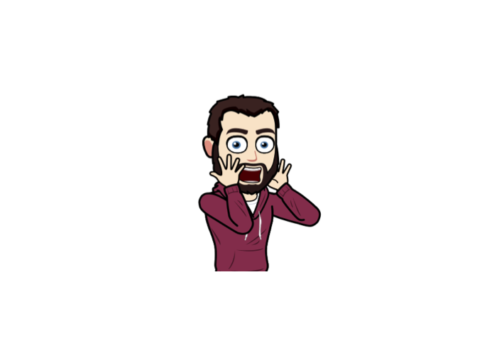
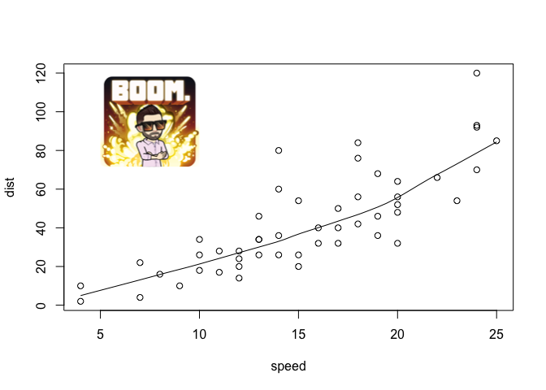
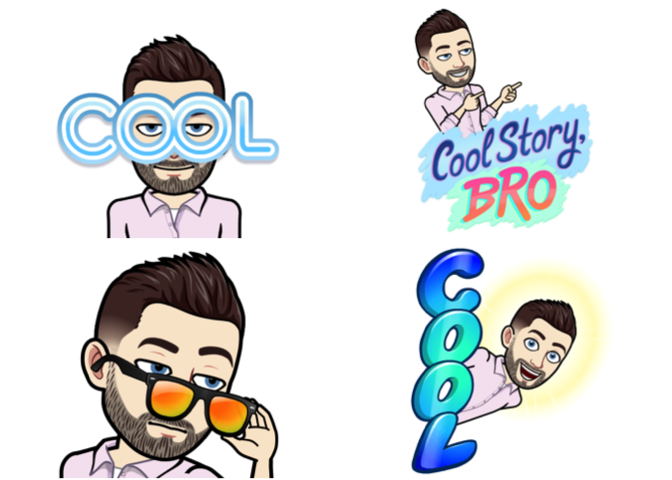

# RBitmoji: An R wrapper to the overly complicated Bitmoji API 

Ya, this is happening…

## Update

You can now plot with friends\!

``` r
# Use get_id() to find your unique user ID
my_id <- "1551b314-5e8a-4477-aca2-088c05963111-v1"
RBitmoji::plot_comic(c(my_id, my_id), tag = "boom")
```



## Installation

You can (try to) install the development version of `RBitmoji` grom
GitHub using

``` r
if (!requireNamespace("devtools")) install.packages("devtools")
devtools::install_github("bgreenwell/RBitmoji")
```

## Basic (and I mean basic) usage

``` r
library(RBitmoji)
set.seed(101)  # for reproducibility
user_id <- "8b06e67b-d4e9-4f11-a355-f1236df17079-v1"  # your (unique) user ID
plot_comic(user_id, tag = "fail")
```


``` r

# Another example
plot_comic(user_id, tag = "time magazine")
```



``` r

# Some tags are associated with multiple comics
par(mfrow = c(2, 2))
for (i in 1:4) plot_comic(user_id, tag = "cool")
```



## The basic idea

``` r
# Load required packages
if (!requireNamespace("magick")) {
  install.packages("magick")
}
library(magick)

# Construct URL
base <- "https://render.bitstrips.com/v2/cpanel"  # base URL
template_id <- "15401"  # not sure about this, yet
comic_id <- "10228164"  # tags: explosion, boom, bad*$%
# user_id <- "128256895_1-s4-v1"  # blank male (Bitmoji version)
user_id <- "8b06e67b-d4e9-4f11-a355-f1236df17079-v1"  # my ID (I think?)
extra <- "?transparent=1&palette=1&scale=1"  # not sure about this, yet
url <- paste0(base, "/", comic_id, "-", user_id, ".png")

# Plot Bitmoji
img <- image_read(url)
plot(as.raster(img))
```


``` r

# Overlay Bitmoji on another plot
scatter.smooth(cars)
rasterImage(img, 5, 70, 10, 120)
```


## Inspirations

  - <https://github.com/JoshCheek/bitmoji>

  - <https://github.com/matthewnau/randmoji>

  - <https://github.com/hadley/emo>
