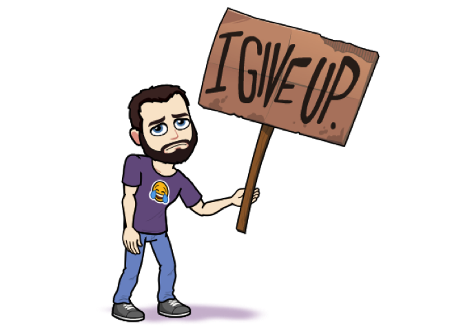

RBitmoji: An R wrapper to the overly complicated Bitmoji API 
=================================================================================================================================================================================================================================================================

Ya, this is happening...

⚠️ **WARNING:** This package is under construction and not very useful at the moment. Help getting it up and running is greatly appreciated, especially since Bitmoji's are critical to data science...

📝 **TODO:**

1.  ✅ ~~Figure out how to incorporate (the apparently missing) background images~~

2.  Figure out a better way to determine your unique user ID

3.  Switch to using [`httr`](https://cran.r-project.org/package=httr) and [`jsonlite`](https://cran.r-project.org/package=jsonlite)

4.  Use JSON file to look up `comic_id` via keyword tags

Installation
------------

You can (try to) install the development version of `RBitmoji` grom GitHub using

``` r
if (!requireNamespace("devtools")) install.packages("devtools")
devtools::install_github("bgreenwell/RBitmoji")
```

Basic (and I mean basic) usage
------------------------------

``` r
library(RBitmoji)
set.seed(105)  # for reproducibility
plot_comic("8b06e67b-d4e9-4f11-a355-f1236df17079-v1", tag = "fml")
```



The basic idea
--------------

``` r
# Load required packages
if (!requireNamespace("magick")) {
  install.packages("magick")
}
library(magick)

# Construct URL
base <- "https://render.bitstrips.com/v2/cpanel"  # base URL
template_id <- "15401"  # not sure about this, yet
comic_id <- "10228164"  # tags: explosion, boom, bad*$%
# user_id <- "128256895_1-s4-v1"  # blank male (Bitmoji version)
user_id <- "8b06e67b-d4e9-4f11-a355-f1236df17079-v1"  # my ID (I think?)
extra <- "?transparent=1&palette=1&scale=1"  # not sure about this, yet
url <- paste0(base, "/", comic_id, "-", user_id, ".png")

# Plot Bitmoji
img <- image_read(url)
plot(as.raster(img))
```


``` r

# Overlay Bitmoji on another plot
scatter.smooth(cars)
rasterImage(img, 5, 70, 10, 120)
```


Inspirations
------------

-   <https://github.com/JoshCheek/bitmoji>

-   <https://github.com/matthewnau/randmoji>

-   <https://github.com/hadley/emo>
